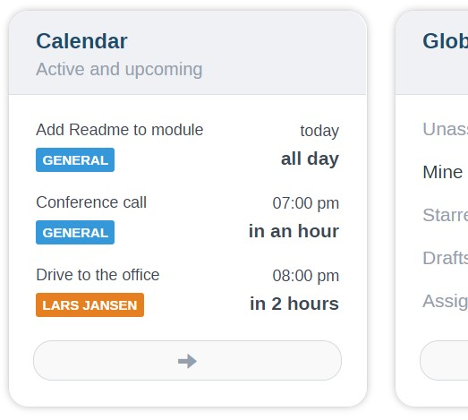
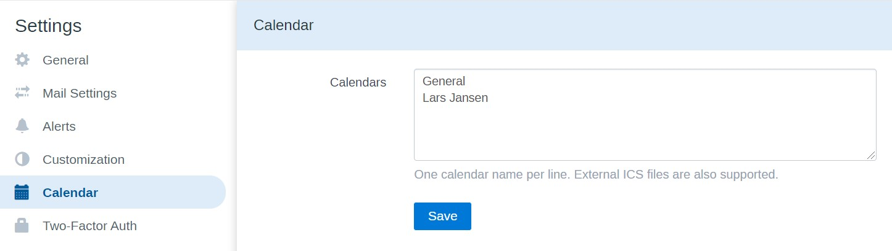
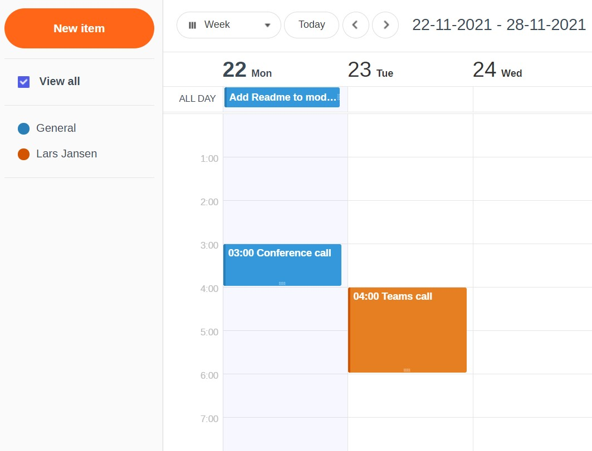
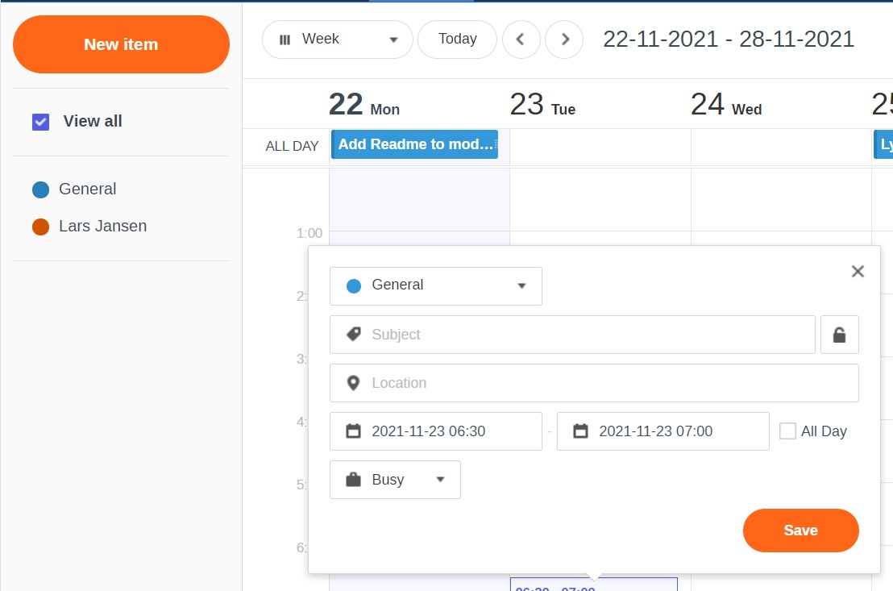
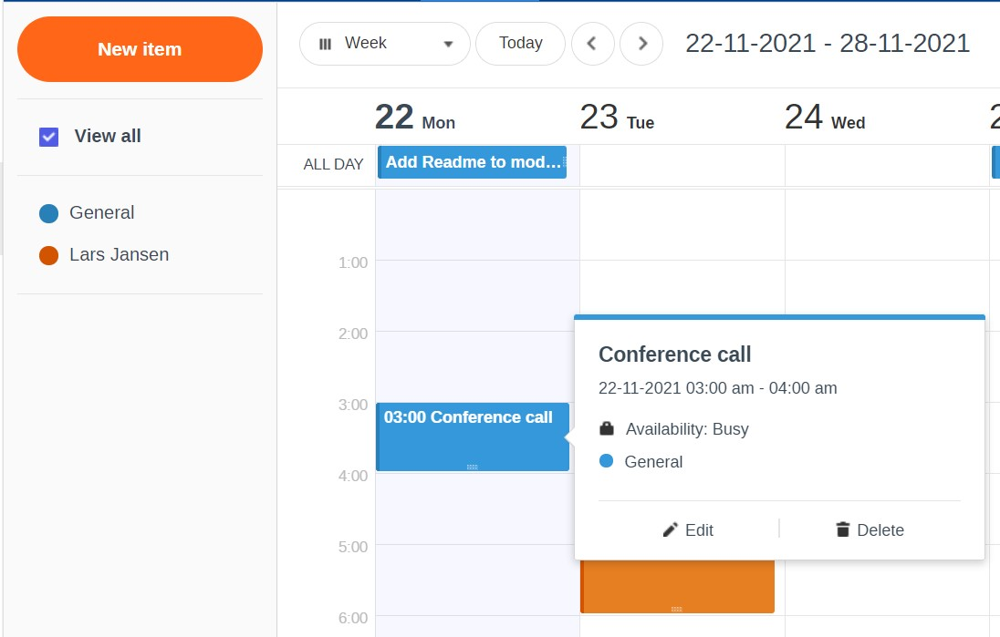
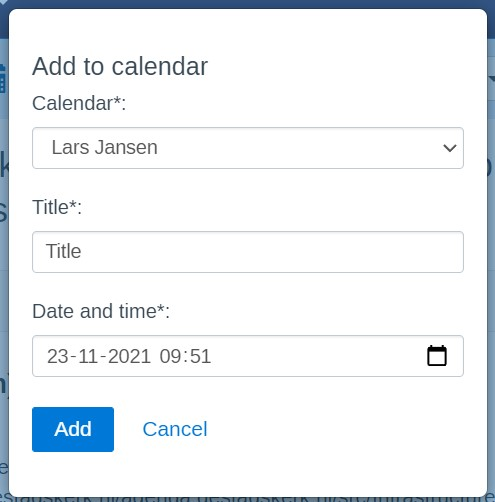

# LJPc calendar module for FreeScout

This module adds a calendar module to FreeScout.

## Functions

- You can add unlimited calendars via the settings page.
- Every text is translatable.
- It is possible to automatically import an external calendar via its URL (.ics files). External calendars are
  automatically pulled every minute.
- Work with multiple people on your calendars without needing to refresh, calendars automatically refresh when something
  is changed.
- Extra card on the dashboard to view the first.
- Every dependency is added to this module, so there are no dependencies on CDNs.

## Installation

1. Download the latest module zip file via the releases card on the right.
2. Transfer the zip file to the server in the Modules folder of FreeScout.
3. Unpack the zip file.
4. Remove the zip file.
5. Activate the module via the Modules page in FreeScout.
6. Add at least one calendar via the Settings page in FreeScout.

## Update instructions

1. Download the latest module zip file via the releases card on the right.
2. Transfer the zip file to the server in the Modules folder of FreeScout.
3. Remove the folder LJPcCalendarModule
4. Unpack the zip file.
5. Remove the zip file.
6. Activate the module via the Modules page in FreeScout.

## The future of this module

Feel free to add your own features by sending a pull request.

What we would like to add in the future ourselves:

- API support; add calendar items via the FreeScout API.
- Responsiveness

## Custom software

Interested in a custom FreeScout module or anything else? Please let us know
via [info@ljpc.nl](mailto:info@ljpc.nl?subject=Calendar%20module) or [www.ljpc.solutions](https://ljpc.solutions).

## Donations

This module took us a lot of time, but we decided to make it open source anyway. If we helped you or your business,
please consider donating.
[Click here](https://www.buymeacoffee.com/Lars-) to donate.

## Screenshots

